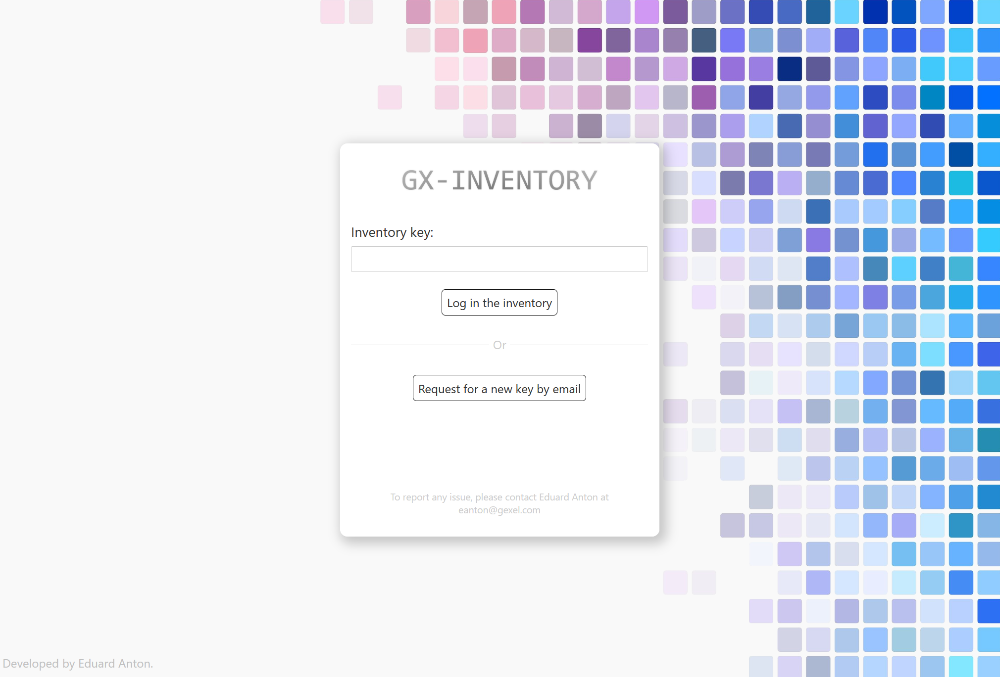
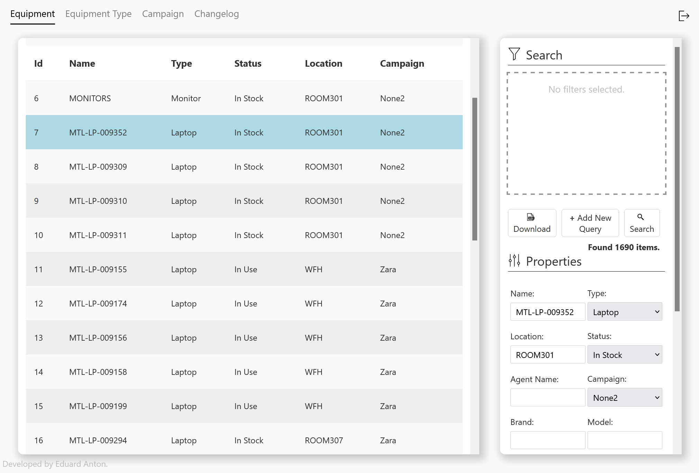

Gx-Inventory is an inventory managing application made in house by Eduard Anton for GEXEL Inc. It provides an interactive web application that allows to create, remove, modify, and look-up the equipment available in the system. Each equipment can be classified by customizable equipment types and campaigns that have unique associated attributes. Authentication is handled via an email verification system that emails keys valid for a certain period of time.

